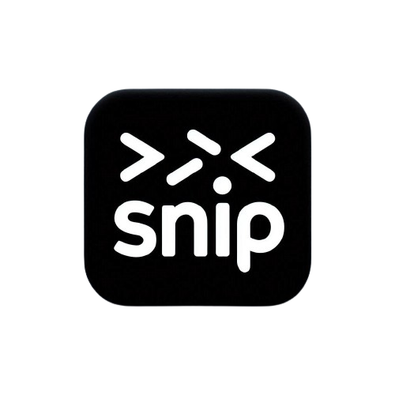
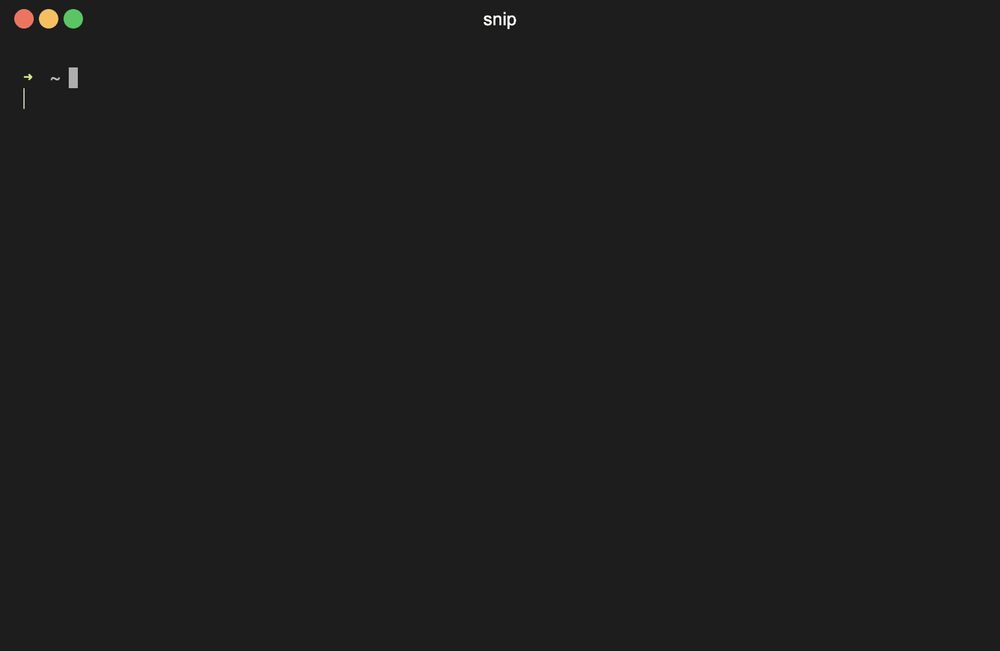

<p align="center">

</p>

<p align="center">
  <a href="https://goreportcard.com/report/github.com/mehran-prs/snip">
    
  </a>
  <a href="https://godoc.org/github.com/mehran-prs/snip">
    
  </a>
  <a href="https://codecov.io/gh/mehran-prs/snip">
    
  </a>
</p>


Snip is a simple and minimal command-line snippet manager.

### Features

- View your snippets on command line and also manage them (create, edit, delete) using your favorite editor.
- Command-line auto-completion for the snippets names (supports `bash`, `zsh`, `fish` and `powershell`).
- Seamlessly integration with `fzf` to provide fuzzy completion(currently supports `zsh` shell).
- Syntax highlighting and Git integration

### How to use

#### View a snippet

- Run `snip {snippet_name}` to view a snippet.
- If you've
  enabled [`fzf` shell integration](https://github.com/junegunn/fzf?tab=readme-ov-file#setting-up-shell-integration) in
  you `zsh` shell, you can find snippets by fuzzy completion. e.g., type `snip **` and pres tab.


#### Edit snippets (Create|Update|Delete)

- Run `snip edit` to open your snippets repository in your favorite editor.
- Run `snip edit {snippet_path}` to create|edit your snippet in your favorite editor.
- Run `snip rm {snippet_path}` to remove a snippet. (use `-r` flag to remove recursively)


### Sync snippets changes with your remote git repository

- Run `snip sync [optional commit message]` to pull and then push your snippets changes. This command runs the following
  commands:

```bash
git pull origin
git add -A
git commit -m "{your_provided_message | default_message}"
git push origin
```



> [!NOTE]
> before running `git sync` for first time, you need to initialize git in your snippets directory and
> also set upstream of your default branch. something like the following commands:

```bash
cd $(snip dir)
git init
git remote add origin  {your_repo_remote_path}
# Push your first commit to setup upstream branch
git add -A && git commit -m "Initial commit"
git push -u origin main
```

### Getting started

- [Install the snip command](#installation).
- [Enable auto-completion](#shell-integration)
- (optional) Set custom [snippets directory path](#customization).
- (optional) [Enable syntax highlighting](#enable-syntax-highlighting) (recommended)
- (optional) [Enable fuzzy completion](#enable-fuzzy-completion) if your shell is `zsh` (recommended).
- [Use `snip`](#how-to-use) :))

### Installation

Install using go:

```bash
go install -ldflags "-X main.Version=main -X main.Date=`date +'%FT%TZ%z'`"  github.com/mehran-prs/snip@main
```

Or get pre-compiled executables [here](http://github.com/mehran-prs/snip/releases)

> [!IMPORTANT]
> To set up completion, see the [instructions below](#shell-integration).

### Shell integration

Add the following line to your shell configuration file.

* bash
  ```sh
  # Set up snip regular and fuzzy completion
  source <(snip completion bash)
  ```
* zsh
  ```sh
  # Set up snip regular and fuzzy completion
  source <(snip completion zsh)
  ```
* fish
  ```fish
  # Set up snip completion
  snip completion fish | source
  ```

> [!NOTE]
> [fzf shell integration](https://github.com/junegunn/fzf?tab=readme-ov-file#setting-up-shell-integration) is a
> pre-requisite of snip fuzzy completion.

### Customization

Set the following env variables to customize snip(e.g., put `export SNIP_DIR=/path/to/dir` in your shell config file):

| Name                     | Default                                             | Description                                                                     |
|--------------------------|-----------------------------------------------------|---------------------------------------------------------------------------------|
| SNIP_DIR                 | `~/snippets`                                        | The snippets directory. It must be absolute path                                |
| SNIP_FILE_VIEWER_CMD     | `cat`                                               | The tool which renders non-markdown files in cmd                                |
| SNIP_MARKDOWN_VIEWER_CMD | `cat`                                               | The tool which renders markdown files in cmd                                    |
| SNIP_EDITOR              | Value of the `EDITOR` env variable, otherwise `vim` | The editor which snip uses to let you edit snippets                             |
| SNIP_GIT                 | `git`                                               | The git command which it uses to sync snippets with your remote git repository  |
| SNIP_EXCLUDE             | `.git,.idea`                                        | comma-separated list of directories that you want to exclude in auto-completion |
| SNIP_VERBOSE             | ""                                                  | Enable verbose mode (values: `true`)                                            |
| SNIP_LOG_TMP_FILENAME    | ""                                                  | Set path to a temporary log file. it's helpful in autocompletion debugging      |

### Commands

```bash
Usage:
  snip [command] [flags]
  snip [command]

Available Commands:
  completion  Generate completion script
  dir         prints the snippets directory
  edit        Create|Edit the snippet in the editor
  help        Help about any command
  rm          Remove a snippet or directory
  sync        sync the snippets changes with your remote git repository
  version     Print the version and build information

Flags:
  -h, --help   help for snip
```

### Enable syntax highlighting

- Install [`bat`](https://github.com/sharkdp/bat) and [`glow`](https://github.com/charmbracelet/glow).

- Set the following env variables in your shell configuration(e.g., `~/.zshrc`):

```bash
export SNIP_FILE_VIEWER_CMD="bat --style plain --paging never"
export SNIP_MARKDOWN_VIEWER_CMD="glow"
```

> [!IMPORTANT]
> On some operating systems (like ubuntu), the `bat` executable may be installed as `batcat` instead of `bat`, in such
> cases, set `batcat` instead of `bat` in `SNIP_FILE_VIEWER_CMD` env variable.

### Enable fuzzy completion

> [!Note]
> Currently fuzzy completion is supported just in zsh.

- Install [`fzf`](https://github.com/junegunn/fzf) to enable fuzzy completion.
- Set up [`fzf` shell integration](https://github.com/junegunn/fzf?tab=readme-ov-file#setting-up-shell-integration)

### Multi-tenancy (Advanced usage)

I like to have multiple instances of the `snip` command under different names for multiple repositories. for example
`snip` to manage my snippets, and `tasks` to manage my tasks.
We can do that by creating a soft-link to the `snip` command (other solutions like aliasing doesn't work
perfectly in auto-completion, at least for me :)) ),
for example to add the `tasks` command, follow these steps:

- Link `tasks` to the `snip` command:

```bash 
ln -s $(whereis snip | awk '{print $2}') /usr/local/bin/tasks
```

- Update your shell config to set the tasks directory for the `tasks` command(as its snippets directory) and also
  enable autocompletion for it:

```bash
# Set the tasks directory (change to your own tasks directory)
export TASKS_DIR=/path/to/my/tasks

# Enable shell auto-completion (in this example, enabled for zsh)
source <(tasks completion zsh)

```

> [!NOTE]
> You may wonder how the `tasks` command reads its directory path from `TASKS_DIR` env variable instead of `SNIP_DIR`,
> actually the `snip` tool reads env variables from `{APPNAME}_{ENV_NAME}` (in this case `TASKS_*`) and if
> it was empty then reads from `SNIP_{ENV_NAME}`.

## Contributing

1. Fork the repository
1. Clone your fork (`git clone https://github.com/<your_username>/snip && cd snip`)
1. Create your feature branch (`git checkout -b my-new-feature`)
1. Make changes and add them (`git add .`)
1. Commit your changes (`git commit -m 'Add some feature'`)
1. Push to the branch (`git push -u origin my-new-feature`)
1. Create new pull request

### Some helper commands for contributors

```bash
# Run tests
go test ./...

# Test coverage
go test -coverprofile cover.out ./...
go tool cover -html cover.out # view as html
go tool cover -func cover.out # output coverage per functions

# Run linters
go install github.com/golangci/golangci-lint/cmd/golangci-lint@v1.58.1
golangci-lint run ./...

# build
go build -o snip .
```
